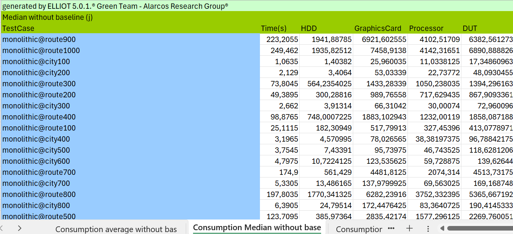
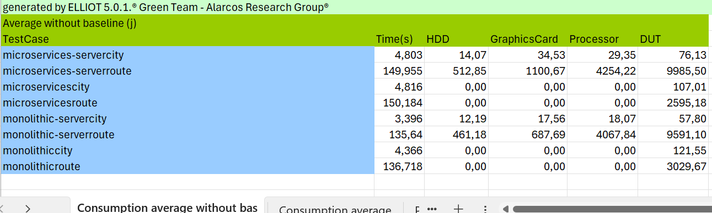

# GSM-Lab: Green Software Measurement Laboratory


[Alberto Gordillo](https://orcid.org/0000-0002-4742-173X)  

[Félix García](https://orcid.org/0000-0001-6460-0353)

[Mª Ángeles Moraga](https://orcid.org/0000-0001-9165-7144)

[Coral Calero](https://orcid.org/0000-0003-0728-4176)

[Carlos Pulido](https://orcid.org/0009-0008-8122-3500)


## Abstract
Growing energy consumption has raised global awareness of the need to reduce its impact, driving efforts in various disciplines, including software engineering. In this field, minimising the energy consumption of applications requires empirical evidence of their impact, making it essential to measure and evaluate software energy consumption to promote improvements. Among the existing approaches, measurement-based energy profiling using hardware or software tools is the most accurate and reliable option. However, this process is complex and requires specialised knowledge and tools.
One possible contribution is the creation of specialised energy measurement laboratories offered as a service to developers. This paper presents GSM-Lab, a laboratory designed to evaluate the energy consumption of software. For this purpose, the FEETINGS framework has been updated to measure monolithic and distributed applications. The goals of GSM-Lab are: (i) advanced automation, (ii) measurement of client-server applications, (iii) integration with evaluation tools, and (iv) both global and detailed code analysis.
The lab incorporates EETHAN (Energy Efficiency Testers in High Automation Network) as a key element to address these challenges. Using enterprise architecture models, it illustrates how GSM-Lab has evolved into a complete solution. 
Its advanced functionality is demonstrated with a measurement case in a client/server environment, highlighting its ability to drive energy improvements in software development. This approach represents an important step in supporting developers to create more energy-efficient software, based on their awareness.

## What is this?

This repository contains the source code used for this study., which were obtained from: Blinowski G, Ojdowska A, Przybylek A (2022) Monolithic vs. microservice architecture: A performance and scalability evaluation. IEEE Access 10:20357–20374

## How is structured?

This folder contains three main folders: code, empirical results and sample logs.

## Code Folder

The code folder contains the software applications that have been measured in this study.

#### The Operations

Each algorithm sub-folder, included in a programming language folder, contains a `Makefile`.
TThis is the file which shows how to perform the 2 main operations: *(1)* **compilation** and *(2)* **execution**.

Basically, each `Makefile` **must** contain a rule:

| Rule | Description |
| -------- | -------- |
| `run` | This rule specifies how the software should be executed; It is used to test whether the software runs with no errors and the output is the expected. 

```
## Empirical Results Folder

The empirical results folder includes all the information on the analysis of the energy consumption of the software. The basic terminology used is as follows:
- An entity class or version corresponds to a monolithic/microservice applicacion. 
- The test case is an call running in a determined monolithic/microservice architecture.
- Measurement is each of the executions of a testcase.

It is structured as follows:

```Java
|<report>
	| <EntityClass-1>@<TestCase-1>.xls
	| ...
	| <EntityClass-i>@<TestCase-i>.xls
	| 
		| <EntityClass-1>@<TestCase>_<Device-1>.png
		| ...
		| <EntityClass-i>@<TestCase>_<Device-i>.png
		|
		| <EntityClass-1>@<TestCase>_dut-1.png
		| ...
		| <EntityClass-i>@<TestCase>_dut-i.png


| testcases_total.xls
| versions_spearman.xls
| versions_total.xls

```
To facilitate the comparison of information, the file "testcases_total" contains one sheet for each statistical value of all test cases. These statistical values are:
Consumption average without baseline, Consumption average (with baseline), Baseline, Power average without baseline, Power average (with baseline) and Standard deviation among measurments 



In the same way as the "testcase_total" document, the "versions_total" document contains the statistical values for each Entity Class.




### Report Folder
The report folder contains the analysis data. One for each test case named `<EntityClass>@<Testcase>`. It also contains two files "testcases_total" and "versions_total" with the summary of the test case and entities software information respectively.
As an example, the following images show the information of a test case.

The first image shows all the information of a measurement.


The second image shows all the information of a test case.


#### Img folder
The img folder contains the graphs of the overall consumption in the execution of each measurement performed. It also includes the box plots of each device for each test case and for each entity software.

## Sample Logs Folder
This folder contains an example of a log, to illustrate the raw data generated by the EET measurement instrument. 
- The json file contains the measurement information of the entity class.
- Each line of microservices-server_EX are the values obtained for id, time, monitor and DUT
- Each line of microservices-serve_IN are the values obtained for id, time, HDD(),HDD(2), Graphics card(1), Graphics card(2),Processor(1) and Processor(2).
DUT hardware components have two values because they have two sensors connected, the result of the DUT hardware component is the sum of the two values.

Note: The rest of the logs of this study are not included in the repository for practical reasons, due to their large size.

## Contacts and References

[Green Team Alarcos](https://greenteamalarcos.uclm.es/)
